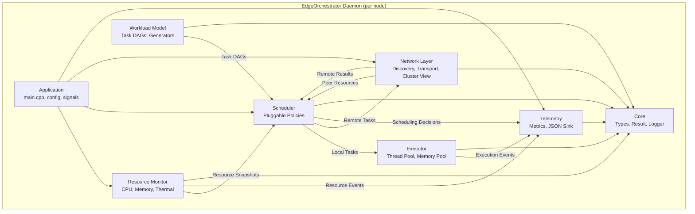
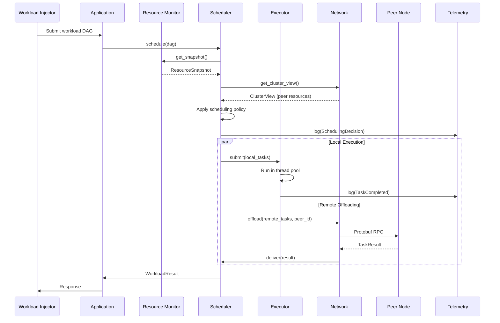

# EdgeOrchestrator — Design Document

**A distributed, adaptive resource orchestrator for dynamic workload scheduling across embedded Linux edge nodes, written in modern C++20.**

**Author:** Dimitris Kafetzis  
**Version:** 1.0 (Implementation Complete)  
**Target Platform:** Raspberry Pi 4/5 — Embedded Linux (64-bit ARM)  
**Language Standard:** C++20 (GCC 12+ / Clang 15+)  
**License:** MIT

---

## Table of Contents

1. [Motivation & Research Context](#1-motivation--research-context)
2. [System Overview](#2-system-overview)
3. [Architecture](#3-architecture)
4. [Module Specifications](#4-module-specifications)
   - 4.1 [Core (`core/`)](#41-core)
   - 4.2 [Resource Monitor (`resource_monitor/`)](#42-resource-monitor)
   - 4.3 [Workload Model (`workload/`)](#43-workload-model)
   - 4.4 [Scheduler (`scheduler/`)](#44-scheduler)
   - 4.5 [Executor (`executor/`)](#45-executor)
   - 4.6 [Network (`network/`)](#46-network)
   - 4.7 [Telemetry (`telemetry/`)](#47-telemetry)
   - 4.8 [Application (`app/`)](#48-application)
5. [C++20 Feature Usage](#5-c20-feature-usage)
6. [Interface Definitions](#6-interface-definitions)
7. [Scheduling Policies](#7-scheduling-policies)
8. [Synthetic Workload Model](#8-synthetic-workload-model)
9. [Inter-Node Protocol](#9-inter-node-protocol)
10. [Build System & Toolchain](#10-build-system--toolchain)
11. [Testing Strategy](#11-testing-strategy)
12. [Project Roadmap](#12-project-roadmap)
13. [References](#13-references)

---

## 1. Motivation & Research Context

### Problem Statement

Deploying AI inference workloads (e.g., deep neural networks, large language models) on resource-constrained edge devices is fundamentally limited by per-device compute capacity, memory, and thermal constraints. When a cluster of edge nodes is available, intelligent workload distribution can dramatically improve throughput, latency, and resource utilization — but this requires an orchestrator that adapts in real time to fluctuating resource availability.

### Research Foundation

This project is a practical realization of research on **dynamic partitioning and resource orchestration for AI model deployment in resource-constrained wireless edge networks**, conducted at the Athens University of Economics and Business. Key publications that inform this design include:

- **DNN Inference Partitioning** — Dynamic partitioning of deep neural network inference across heterogeneous edge devices with per-layer cost modeling.
- **LLM Partitioning with Dynamic Memory Management** — Extending partitioning to transformer architectures with KV-cache-aware memory budgeting.
- **Multi-Layer Transformer Partitioning with Speculative Execution** — Cross-layer similarity discovery and layer-level speculative execution for reduced inference latency.

The synthetic workload model in this project mirrors the computational characteristics of transformer layers (configurable compute cost, memory footprint, inter-layer data dependencies), and the optimization-based scheduling policy implements a lightweight version of the partitioning formulations from the above research.

### Goals

1. **Demonstrate modern C++20 mastery** in a systems-level, distributed context.
2. **Bridge academic research and production engineering** by implementing research-inspired scheduling algorithms in a real, deployable system.
3. **Provide a clean, extensible architecture** that can serve as a reference for embedded distributed systems design.
4. **Run on real hardware** (Raspberry Pi cluster) while remaining fully testable on a single desktop machine via simulation.

---

## 2. System Overview

### High-Level Description

EdgeOrchestrator is a distributed daemon that runs on each node in a cluster of embedded Linux devices. Each daemon instance:

1. **Monitors** local hardware resources (CPU, memory, thermal, network) continuously.
2. **Discovers** peer nodes via UDP broadcast and maintains a cluster membership view.
3. **Advertises** its resource availability to all peers periodically.
4. **Receives** workload submission requests — directed acyclic graphs (DAGs) of computational tasks.
5. **Schedules** tasks across the cluster using a pluggable policy, deciding what runs locally vs. what gets offloaded to peers.
6. **Executes** locally scheduled tasks in a managed thread pool with memory and CPU budgets.
7. **Offloads** remotely scheduled tasks to peer nodes via Protobuf-serialized RPC over TCP.
8. **Collects** intermediate results from remote executions and assembles final outputs.
9. **Logs** every decision, resource snapshot, and execution event as structured NDJSON for offline analysis.

### Deployment Topologies

```
┌─────────────────────────────────────────────────────────────┐
│                    Physical Deployment                       │
│                                                             │
│   ┌──────────┐    ┌──────────┐    ┌──────────┐             │
│   │  RPi #1  │◄──►│  RPi #2  │◄──►│  RPi #3  │             │
│   │ (Node A) │    │ (Node B) │    │ (Node C) │             │
│   └──────────┘    └──────────┘    └──────────┘             │
│        ▲               ▲               ▲                    │
│        └───────────────┼───────────────┘                    │
│              LAN / Wi-Fi Mesh                               │
└─────────────────────────────────────────────────────────────┘

┌─────────────────────────────────────────────────────────────┐
│                   Simulated Deployment                       │
│                                                             │
│   ┌──────────────────────────────────┐                      │
│   │       Single Desktop / CI        │                      │
│   │                                  │                      │
│   │  Node A ◄──► Node B ◄──► Node C │                      │
│   │  :5001       :5002       :5003   │                      │
│   │      (localhost, different ports) │                      │
│   └──────────────────────────────────┘                      │
└─────────────────────────────────────────────────────────────┘
```

---

## 3. Architecture

### Component Diagram



### Data Flow



### Design Principles

1. **Separation of Concerns:** Each module has a single responsibility and communicates through well-defined interfaces.
2. **Hybrid Polymorphism:** Concepts (static polymorphism) for performance-critical hot paths (scheduling, execution). Virtual interfaces for configuration-time flexibility (config loaders, log sinks).
3. **Zero-Cost Where It Matters:** No dynamic allocation in the execution hot path. Arena allocators for task metadata, `std::span` for zero-copy buffer views.
4. **Testability First:** Every module depends on abstractions, not concretions. Mock implementations for resource monitor, network, and executor enable comprehensive unit testing.
5. **Graceful Degradation:** If a peer node becomes unreachable, tasks are rescheduled locally. If local resources are exhausted, tasks are queued rather than dropped.

---

## 4. Module Specifications

### 4.1 Core

**Purpose:** Shared type definitions, error handling, and utilities used by all modules.

**Key Components:**

| File | Description |
|------|-------------|
| `types.hpp` | Fundamental types: `NodeId`, `TaskId`, `Timestamp`, `ResourceSnapshot`, `Duration` |
| `result.hpp` | `Result<T, E>` — a monadic error type wrapping `std::expected` (C++23) or a custom implementation |
| `logger.hpp` | `ILogSink` virtual interface for pluggable log destinations |
| `config.hpp` | `Config` struct with TOML/YAML deserialization for daemon configuration |
| `concepts.hpp` | Shared C++20 concept definitions used across modules |

**`ResourceSnapshot` Structure:**

```cpp
struct ResourceSnapshot {
    NodeId              node_id;
    Timestamp           timestamp;
    float               cpu_usage_percent;       // Aggregate CPU usage [0.0, 100.0]
    std::array<float,4> per_core_cpu_percent;    // Per-core (RPi4 has 4 cores)
    uint64_t            memory_available_bytes;
    uint64_t            memory_total_bytes;
    float               cpu_temperature_celsius;
    float               gpu_temperature_celsius;
    uint64_t            network_rx_bytes_sec;    // Receive throughput
    uint64_t            network_tx_bytes_sec;    // Transmit throughput
    bool                is_throttled;            // Thermal throttling active

    [[nodiscard]] float memory_usage_percent() const noexcept;
    [[nodiscard]] float cpu_headroom_percent() const noexcept;
};
```

**`Result<T, E>` Pattern:**

```cpp
template <typename T, typename E = std::string>
using Result = std::expected<T, E>;

// Usage:
Result<ResourceSnapshot> snapshot = monitor.read();
if (snapshot) {
    process(*snapshot);
} else {
    logger.error("Monitor failed: {}", snapshot.error());
}
```

### 4.2 Resource Monitor

**Purpose:** Continuously reads system resource metrics from Linux pseudo-filesystems and exposes them to the scheduler.

**Interface (Concept-constrained for hot path):**

```cpp
template <typename T>
concept ResourceMonitorLike = requires(T monitor) {
    { monitor.read() } -> std::same_as<Result<ResourceSnapshot>>;
    { monitor.cpu_usage() } -> std::convertible_to<float>;
    { monitor.memory_available() } -> std::convertible_to<uint64_t>;
    { monitor.is_throttled() } -> std::convertible_to<bool>;
};
```

**Implementation Details:**

| Metric | Linux Source | Read Method |
|--------|-------------|-------------|
| CPU Usage | `/proc/stat` | Delta of `user+nice+system` vs `idle` over sampling interval |
| Memory | `/proc/meminfo` | `MemAvailable` field |
| Temperature | `/sys/class/thermal/thermal_zone0/temp` | Direct read, divide by 1000 |
| Throttling | `/sys/devices/platform/soc/soc:firmware/get_throttled` | Bitfield (RPi-specific) |
| Network I/O | `/proc/net/dev` | Delta of `rx_bytes` / `tx_bytes` per interface |

**Sampling Strategy:**

- A dedicated `std::jthread` samples at a configurable interval (default: 500ms).
- The latest snapshot is stored in a `std::atomic<std::shared_ptr<ResourceSnapshot>>` for lock-free reads.
- An observer pattern allows modules to register callbacks for threshold-crossing events (e.g., memory > 80%).

**Mock Implementation:**

`MockResourceMonitor` allows injection of predetermined resource sequences for testing. It satisfies the same `ResourceMonitorLike` concept.

### 4.3 Workload Model

**Purpose:** Represents computational tasks and their dependency relationships as directed acyclic graphs (DAGs).

**Key Types:**

```cpp
struct TaskProfile {
    std::chrono::microseconds compute_cost;   // Expected execution time
    uint64_t                  memory_bytes;    // Working memory requirement
    uint64_t                  input_bytes;     // Input data size (transfer cost)
    uint64_t                  output_bytes;    // Output data size (transfer cost)
};

struct Task {
    TaskId                     id;
    std::string                name;
    TaskProfile                profile;
    std::vector<TaskId>        dependencies;   // Must complete before this task
    TaskState                  state = TaskState::Pending;
};

enum class TaskState : uint8_t {
    Pending,       // Waiting for dependencies
    Ready,         // All dependencies met, awaiting scheduling
    Scheduled,     // Assigned to a node
    Running,       // Currently executing
    Completed,     // Finished successfully
    Failed         // Execution failed
};
```

**DAG Representation:**

```cpp
class WorkloadDAG {
public:
    // Construction
    TaskId add_task(Task task);
    void add_dependency(TaskId from, TaskId to);  // 'from' must complete before 'to'

    // Queries
    [[nodiscard]] std::vector<TaskId> topological_order() const;
    [[nodiscard]] std::vector<TaskId> ready_tasks() const;        // No unmet dependencies
    [[nodiscard]] std::span<const TaskId> dependents(TaskId) const;
    [[nodiscard]] std::span<const TaskId> dependencies(TaskId) const;
    [[nodiscard]] bool is_valid() const;                          // Acyclicity check

    // State updates
    void mark_completed(TaskId id);
    void mark_failed(TaskId id);

    // Metrics
    [[nodiscard]] std::chrono::microseconds critical_path_cost() const;
    [[nodiscard]] uint64_t peak_memory_estimate() const;

private:
    std::unordered_map<TaskId, Task> tasks_;
    std::unordered_map<TaskId, std::vector<TaskId>> adj_list_;      // forward edges
    std::unordered_map<TaskId, std::vector<TaskId>> reverse_adj_;   // backward edges
};
```

**Synthetic Workload Generator:**

```cpp
class WorkloadGenerator {
public:
    // Topology presets (model common AI workload patterns)
    static WorkloadDAG linear_chain(size_t num_tasks, TaskProfile base_profile);
    static WorkloadDAG fan_out_fan_in(size_t width, TaskProfile base_profile);
    static WorkloadDAG diamond(size_t depth, size_t width, TaskProfile base_profile);
    static WorkloadDAG transformer_layers(size_t num_layers,
                                          uint64_t hidden_dim,
                                          uint64_t kv_cache_bytes);

    // Randomized generation
    static WorkloadDAG random_dag(size_t num_tasks,
                                  float edge_probability,
                                  TaskProfile min_profile,
                                  TaskProfile max_profile,
                                  std::mt19937& rng);
};
```

### 4.4 Scheduler

**Purpose:** The decision-making core. Receives resource snapshots and workload DAGs, produces a scheduling plan mapping tasks to nodes.

**Scheduling Plan Output:**

```cpp
struct SchedulingDecision {
    TaskId  task_id;
    NodeId  assigned_node;     // Which node executes this task
    enum class Reason : uint8_t {
        LocalCapacity,         // Sufficient local resources
        LeastLoaded,           // Greedy: assigned to least-loaded node
        ThresholdOffload,      // Local load exceeded threshold
        OptimizationResult,    // Result of optimization solver
        Fallback               // All peers unavailable, run locally
    } reason;
};

struct SchedulingPlan {
    std::vector<SchedulingDecision>  decisions;
    std::chrono::microseconds        estimated_makespan;
    Timestamp                        computed_at;
};
```

**Policy Interface (Concept for hot path):**

```cpp
template <typename T>
concept SchedulingPolicyLike = requires(
    T policy,
    const WorkloadDAG& dag,
    const ResourceSnapshot& local,
    const ClusterView& cluster
) {
    { policy.schedule(dag, local, cluster) } -> std::same_as<SchedulingPlan>;
    { T::name() } -> std::convertible_to<std::string_view>;
};
```

Three policies are provided (see [Section 7](#7-scheduling-policies) for algorithmic details):

1. **`GreedyPolicy`** — Assigns each ready task to the node with the most available resources.
2. **`ThresholdPolicy`** — Executes locally until a load threshold is breached, then offloads.
3. **`OptimizerPolicy`** — Minimizes estimated makespan subject to per-node resource constraints.

**Policy Selection at Runtime:**

While individual policies are concept-constrained (compile-time dispatch), the daemon selects which policy to instantiate based on configuration. This is achieved via a `std::variant<GreedyPolicy, ThresholdPolicy, OptimizerPolicy>` and `std::visit`, avoiding virtual dispatch while preserving runtime configurability.

```cpp
using PolicyVariant = std::variant<GreedyPolicy, ThresholdPolicy, OptimizerPolicy>;

SchedulingPlan schedule(PolicyVariant& policy,
                        const WorkloadDAG& dag,
                        const ResourceSnapshot& local,
                        const ClusterView& cluster) {
    return std::visit([&](auto& p) { return p.schedule(dag, local, cluster); }, policy);
}
```

### 4.5 Executor

**Purpose:** Manages local task execution with resource budgets, using a `std::jthread`-based thread pool.

**Thread Pool Design:**

```cpp
class ThreadPool {
public:
    explicit ThreadPool(size_t num_threads);  // Default: hardware_concurrency()
    ~ThreadPool();  // jthreads auto-join via stop tokens

    // Submit a task for execution
    template <std::invocable F>
    std::future<std::invoke_result_t<F>> submit(F&& func);

    // Submit with cancellation support
    template <std::invocable<std::stop_token> F>
    std::future<std::invoke_result_t<F, std::stop_token>> submit_cancellable(F&& func);

    // Metrics
    [[nodiscard]] size_t active_count() const noexcept;
    [[nodiscard]] size_t queued_count() const noexcept;

private:
    std::vector<std::jthread> workers_;
    // Lock-free MPMC queue for task submission
    ConcurrentQueue<std::move_only_function<void()>> task_queue_;
};
```

**Memory Pool (Arena Allocator):**

For the execution hot path, dynamic allocation is avoided. A per-task arena allocator provides fast, predictable allocation:

```cpp
class MemoryPool {
public:
    explicit MemoryPool(size_t capacity_bytes);

    [[nodiscard]] void* allocate(size_t size, size_t alignment = alignof(std::max_align_t));
    void reset() noexcept;  // Deallocate all at once (arena-style)

    [[nodiscard]] size_t used() const noexcept;
    [[nodiscard]] size_t capacity() const noexcept;
    [[nodiscard]] bool can_allocate(size_t size) const noexcept;

private:
    std::unique_ptr<std::byte[]> buffer_;
    size_t capacity_;
    std::atomic<size_t> offset_{0};
};
```

**Task Runner:**

Wraps actual task execution with budget enforcement:

```cpp
class TaskRunner {
public:
    struct ExecutionResult {
        TaskId                     task_id;
        TaskState                  final_state;
        std::chrono::microseconds  actual_duration;
        uint64_t                   peak_memory_bytes;
        std::optional<std::string> error_message;
    };

    ExecutionResult execute(const Task& task,
                            MemoryPool& pool,
                            std::stop_token stop);
};
```

### 4.6 Network

**Purpose:** Inter-node communication — peer discovery, resource advertisement, task offloading, and result collection.

**Sub-Components:**

#### 4.6.1 Peer Discovery (`peer_discovery.hpp`)

- **Mechanism:** UDP broadcast on a configurable port (default: 5200).
- **Heartbeat:** Each node broadcasts a `NodeAdvertisement` every 2 seconds.
- **Timeout:** Peers not heard from in 6 seconds (3 missed heartbeats) are marked unreachable.

```cpp
// Protobuf message
message NodeAdvertisement {
    string node_id = 1;
    string address = 2;      // IP:port for TCP transport
    uint32 tcp_port = 3;
    ResourceSummary resources = 4;
    uint64 timestamp_ms = 5;
}
```

#### 4.6.2 Transport (`transport.hpp`)

- **Protocol:** TCP with Protobuf-serialized messages.
- **Async I/O:** C++20 coroutines wrapping `epoll` (Linux) for non-blocking send/receive.
- **Framing:** Length-prefixed messages (4-byte big-endian size header + Protobuf payload).

```cpp
class AsyncTransport {
public:
    // Coroutine-based async operations
    Task<void> connect(std::string_view address, uint16_t port);
    Task<void> send(const google::protobuf::Message& msg);
    Task<std::unique_ptr<google::protobuf::Message>> receive();
    Task<void> close();

private:
    int socket_fd_;
    // epoll integration for cooperative scheduling
};
```

> **Note:** `Task<T>` here refers to a coroutine return type (C++20 coroutine handle wrapper), not a workload `Task`.

#### 4.6.3 Cluster View (`cluster_view.hpp`)

Aggregates peer information into a consistent view for the scheduler:

```cpp
class ClusterView {
public:
    void update_peer(NodeId id, ResourceSnapshot snapshot);
    void remove_peer(NodeId id);

    [[nodiscard]] std::vector<NodeId> available_peers() const;
    [[nodiscard]] std::optional<ResourceSnapshot> peer_resources(NodeId id) const;
    [[nodiscard]] NodeId least_loaded_peer() const;
    [[nodiscard]] size_t cluster_size() const noexcept;

private:
    mutable std::shared_mutex mutex_;
    std::unordered_map<NodeId, PeerInfo> peers_;
};
```

#### 4.6.4 Protocol Messages (`protocol.proto`)

```protobuf
syntax = "proto3";
package edge_orchestrator;

// Resource advertisement (UDP broadcast)
message NodeAdvertisement {
    string node_id = 1;
    string address = 2;
    uint32 tcp_port = 3;
    ResourceSummary resources = 4;
    uint64 timestamp_ms = 5;
}

message ResourceSummary {
    float cpu_usage_percent = 1;
    uint64 memory_available_bytes = 2;
    uint64 memory_total_bytes = 3;
    float temperature_celsius = 4;
    bool is_throttled = 5;
}

// Task offloading (TCP)
message OffloadRequest {
    string request_id = 1;
    string task_id = 2;
    string task_name = 3;
    TaskProfile profile = 4;
    bytes input_data = 5;
}

message TaskProfile {
    uint64 compute_cost_us = 1;
    uint64 memory_bytes = 2;
    uint64 input_bytes = 3;
    uint64 output_bytes = 4;
}

message OffloadResponse {
    string request_id = 1;
    string task_id = 2;
    bool success = 3;
    bytes output_data = 4;
    uint64 actual_duration_us = 5;
    string error_message = 6;
}

// Wrapper for multiplexing message types
message Envelope {
    oneof payload {
        NodeAdvertisement advertisement = 1;
        OffloadRequest offload_request = 2;
        OffloadResponse offload_response = 3;
    }
}
```

### 4.7 Telemetry

**Purpose:** Structured event logging as NDJSON (newline-delimited JSON) for offline analysis.

**Design Rationale:** JSON logs keep the daemon lightweight (no web server, no dashboard), while providing rich, queryable data. Tools like `jq`, Python scripts, or Grafana (with Loki) can consume NDJSON directly.

**Event Types:**

```cpp
// Virtual interface (runtime-configurable sinks)
class ILogSink {
public:
    virtual ~ILogSink() = default;
    virtual void write(std::string_view json_line) = 0;
    virtual void flush() = 0;
};

// Concrete sinks
class JsonFileSink : public ILogSink { /* writes to rotating NDJSON files */ };
class StdoutSink : public ILogSink { /* writes to stdout for debugging */ };
class NullSink : public ILogSink { /* discards — for benchmarking */ };
```

**Event Schema (examples):**

```json
{"event":"resource_snapshot","ts":"2025-02-13T10:30:00.123Z","node":"rpi-01","cpu_pct":45.2,"mem_avail_mb":1024,"temp_c":52.3,"throttled":false}
{"event":"scheduling_decision","ts":"2025-02-13T10:30:00.456Z","node":"rpi-01","task":"layer_3","assigned_to":"rpi-02","policy":"optimizer","reason":"offload","makespan_est_us":12500}
{"event":"task_completed","ts":"2025-02-13T10:30:01.789Z","node":"rpi-02","task":"layer_3","duration_us":11800,"peak_mem_bytes":2097152,"status":"success"}
{"event":"peer_discovered","ts":"2025-02-13T10:30:00.050Z","node":"rpi-01","peer":"rpi-03","address":"192.168.1.103:5201"}
{"event":"peer_lost","ts":"2025-02-13T10:35:06.000Z","node":"rpi-01","peer":"rpi-03","reason":"heartbeat_timeout"}
```

**Metrics Collector:**

```cpp
class MetricsCollector {
public:
    explicit MetricsCollector(std::unique_ptr<ILogSink> sink);

    void record_resource_snapshot(const ResourceSnapshot& snap);
    void record_scheduling_decision(const SchedulingDecision& decision);
    void record_task_event(TaskId id, TaskState state, std::chrono::microseconds duration);
    void record_peer_event(NodeId peer, std::string_view event_type);
    void record_custom(std::string_view event, std::string_view json_payload);

    void flush();

private:
    std::unique_ptr<ILogSink> sink_;
    std::mutex write_mutex_;
};
```

### 4.8 Application

**Purpose:** Daemon entry point — configuration loading, module initialization, signal handling, and main event loop.

**Startup Sequence:**

1. Parse command-line arguments (`--config`, `--node-id`, `--port`, `--log-dir`).
2. Load TOML configuration file.
3. Initialize `MetricsCollector` with configured log sink.
4. Initialize `ResourceMonitor` (or `MockResourceMonitor` in simulation mode).
5. Initialize `ThreadPool` with configured thread count.
6. Initialize `NetworkLayer` (peer discovery + TCP transport).
7. Initialize `Scheduler` with configured policy variant.
8. Register `SIGINT`/`SIGTERM` handlers for graceful shutdown via `std::jthread` stop tokens.
9. Enter main loop: accept workload submissions, trigger scheduling, manage execution.

**Configuration File (`config.toml`):**

```toml
[node]
id = "rpi-01"                      # Unique node identifier
port = 5201                        # TCP port for inter-node communication
discovery_port = 5200              # UDP broadcast port

[monitor]
sampling_interval_ms = 500         # Resource sampling period
mock = false                       # Use MockResourceMonitor for testing

[executor]
thread_count = 4                   # Worker threads (0 = hardware_concurrency)
memory_pool_mb = 64                # Arena allocator capacity

[scheduler]
policy = "optimizer"               # "greedy", "threshold", or "optimizer"

[scheduler.threshold]              # ThresholdPolicy-specific config
cpu_threshold_percent = 75.0
memory_threshold_percent = 80.0

[scheduler.optimizer]              # OptimizerPolicy-specific config
max_iterations = 100
communication_weight = 0.3         # Weight of network transfer cost

[network]
heartbeat_interval_ms = 2000
peer_timeout_ms = 6000
max_message_size_bytes = 1048576   # 1 MB

[telemetry]
log_dir = "./logs"
max_file_size_mb = 50
rotate_count = 5
log_level = "info"                 # "debug", "info", "warn", "error"
```

---

## 5. C++20 Feature Usage

This section maps specific C++20 features to their usage locations, demonstrating deliberate and idiomatic adoption.

| Feature | Module | Usage |
|---------|--------|-------|
| **Concepts** | `resource_monitor/`, `scheduler/` | `ResourceMonitorLike`, `SchedulingPolicyLike` — constrain template parameters for hot-path interfaces with zero virtual dispatch overhead |
| **Coroutines** | `network/transport.hpp` | `Task<T>` coroutine type for async TCP send/receive, avoiding callback-heavy designs |
| **`std::jthread`** | `executor/thread_pool.hpp`, `resource_monitor/` | Cooperative cancellation via `std::stop_token`; automatic join on destruction (RAII) |
| **`std::format`** | `telemetry/`, `core/logger.hpp` | Type-safe string formatting for JSON event construction and diagnostic messages |
| **Ranges & Views** | `workload/dag.hpp`, `scheduler/` | `std::views::filter`, `std::views::transform` for DAG traversal, filtering available nodes, sorting tasks by priority |
| **`std::span`** | `network/`, `executor/` | Zero-copy views over serialized Protobuf buffers and memory pool regions |
| **`std::expected`** | `core/result.hpp` | Monadic error handling (`Result<T, E>`) replacing exceptions in performance-critical paths |
| **Designated Initializers** | `core/types.hpp`, `core/config.hpp` | Clean, self-documenting struct construction: `TaskProfile{.compute_cost = 1ms, .memory_bytes = 4096}` |
| **`std::variant` + `std::visit`** | `scheduler/` | Runtime policy selection without virtual dispatch: `PolicyVariant` |
| **Three-way Comparison (`<=>`)** | `workload/task.hpp` | Task priority ordering for scheduling queues |
| **`constexpr` Extensions** | `core/types.hpp` | Compile-time computation of constants (e.g., default pool sizes, protocol magic numbers) |
| **Structured Bindings** | Throughout | Idiomatic destructuring of pairs, tuples, and struct returns |

---

## 6. Interface Definitions

### Hybrid Polymorphism Strategy

The project employs a deliberate hybrid approach:

**Concepts (Compile-time, zero-cost)** — Used for interfaces on the hot path where performance matters and the set of implementations is known at compile time:

- `ResourceMonitorLike` — Called every sampling interval; must be fast.
- `SchedulingPolicyLike` — Called on every scheduling round; inner loops must be tight.
- `SerializerLike` — Message serialization is invoked on every network send/receive.

**Virtual Interfaces (Runtime, flexible)** — Used for configuration-time decisions and non-hot-path extensibility:

- `ILogSink` — Log destinations are configured at startup and not changed during execution. Virtual dispatch cost is negligible relative to I/O.
- `IConfigSource` — Configuration is read once at startup.
- `IWorkloadSource` — Workload submission endpoint (could be Unix socket, HTTP, or stdin).

This hybrid approach ensures maximum performance where it matters while maintaining clean extensibility points.

---

## 7. Scheduling Policies

### 7.1 Greedy Policy

**Algorithm:** For each ready task in topological order, assign it to the node (local or peer) with the highest available resource headroom, weighted by the task's profile.

```
for each task in topological_order(dag):
    if task.is_ready():
        best_node = argmax over all nodes n:
            score(n) = w_cpu * cpu_headroom(n) + w_mem * mem_headroom(n)
                       - w_net * transfer_cost(task, n)
        assign(task, best_node)
```

**Complexity:** O(T × N) where T = tasks, N = nodes.  
**Strengths:** Simple, fast, low overhead.  
**Weaknesses:** No global view; may make locally optimal but globally suboptimal decisions.

### 7.2 Threshold Policy

**Algorithm:** Execute all tasks locally until a resource threshold is breached. When breached, offload the next ready task to the least-loaded peer. Resume local execution when below threshold.

```
for each task in topological_order(dag):
    if task.is_ready():
        if local.cpu_usage < cpu_threshold AND local.mem_usage < mem_threshold:
            assign(task, local_node)
        else:
            peer = least_loaded_peer(cluster)
            if peer exists:
                assign(task, peer)
            else:
                queue(task)  // Wait for resources
```

**Complexity:** O(T × log N) with a sorted peer list.  
**Strengths:** Predictable behavior; easy to tune; minimal network overhead when load is low.  
**Weaknesses:** Reactive (waits until threshold is hit); no predictive scheduling.

### 7.3 Optimizer Policy

**Algorithm:** Formulates the scheduling problem as a makespan minimization subject to per-node resource constraints. This is inspired by the partitioning formulations in the author's research on DNN/LLM inference partitioning.

**Objective:** Minimize the total completion time (makespan) of the DAG:

```
minimize    max over all nodes n: completion_time(n)

subject to:
    (1) Each task assigned to exactly one node
    (2) For each node n: sum of memory(assigned_tasks) <= memory_available(n)
    (3) For each node n: sum of compute(assigned_tasks) <= time_budget
    (4) Dependency constraints: start_time(task_j) >= end_time(task_i) + comm_cost(i,j)
        where comm_cost(i,j) = 0 if same node, else transfer_time(output_i)
```

**Solution Method:** Since exact ILP/CP solving is too heavy for real-time embedded use, we implement a **fast heuristic**:

1. Compute the critical path of the DAG.
2. Assign critical-path tasks to minimize inter-node communication.
3. Distribute remaining tasks using a bin-packing heuristic (First Fit Decreasing by compute cost).
4. Apply local search (task swaps between nodes) for a configurable number of iterations.

**Complexity:** O(T × N × I) where I = max iterations of local search.  
**Strengths:** Globally aware; considers communication costs; produces near-optimal plans.  
**Weaknesses:** Higher computational overhead; requires tuning of iteration count.

---

## 8. Synthetic Workload Model

### Rationale

For v1.0, we use synthetic workloads that model the computational characteristics of real AI inference without requiring actual model files or inference frameworks. This keeps the build lightweight and focuses the project on orchestration rather than ML runtime concerns.

### Task Simulation

Each synthetic task simulates work by:

1. **Allocating** `memory_bytes` from the `MemoryPool`.
2. **Busy-spinning** or performing synthetic compute (matrix multiplications, hash iterations) for `compute_cost` microseconds.
3. **Producing** `output_bytes` of synthetic output data (random or zeroed).

```cpp
ExecutionResult SyntheticTaskRunner::execute(const Task& task,
                                             MemoryPool& pool,
                                             std::stop_token stop) {
    auto start = std::chrono::steady_clock::now();

    // Allocate working memory
    void* mem = pool.allocate(task.profile.memory_bytes);
    if (!mem) return {task.id, TaskState::Failed, {}, 0, "OOM"};

    // Simulate computation (busy work calibrated to target duration)
    simulate_compute(task.profile.compute_cost, stop);

    auto duration = std::chrono::steady_clock::now() - start;
    pool.reset();

    return {
        .task_id = task.id,
        .final_state = TaskState::Completed,
        .actual_duration = std::chrono::duration_cast<std::chrono::microseconds>(duration),
        .peak_memory_bytes = task.profile.memory_bytes,
        .error_message = std::nullopt
    };
}
```

### Preset Workload Topologies

| Topology | Description | AI Analogy |
|----------|-------------|------------|
| **Linear Chain** | T1 → T2 → T3 → ... → Tn | Sequential layer inference (no parallelism) |
| **Fan-out/Fan-in** | T1 → {T2a, T2b, T2c} → T3 | Parallel attention heads, multi-branch architectures |
| **Diamond** | Repeated fan-out/fan-in at each depth level | Multi-layer parallel inference |
| **Transformer** | Attention + FFN per layer, with KV-cache memory scaling | Realistic transformer LLM inference |

### Configurable Parameters

```toml
[workload.preset]
type = "transformer"        # "chain", "fan_out_fan_in", "diamond", "transformer", "random"
num_layers = 12
hidden_dim = 768
kv_cache_per_layer_kb = 512
compute_per_layer_ms = 5
```

---

## 9. Inter-Node Protocol

### Communication Architecture

```
┌─────────────────────────────┐
│         Application         │
├─────────────────────────────┤
│     Cluster View (state)    │
├──────────────┬──────────────┤
│ Peer         │ Task         │
│ Discovery    │ Offloading   │
│ (UDP bcast)  │ (TCP p2p)    │
├──────────────┴──────────────┤
│   Protobuf Serialization    │
├─────────────────────────────┤
│     Linux Sockets API       │
└─────────────────────────────┘
```

### Message Flow

**Peer Discovery (UDP):**

```
Node A                    Network (broadcast)              Node B
  │                                                          │
  ├──► NodeAdvertisement ──► [broadcast 255.255.255.255] ──► │
  │    {id: "rpi-01",                                        │
  │     address: "192.168.1.101",                            │
  │     tcp_port: 5201,                                      │
  │     resources: {...},                                    │
  │     timestamp_ms: ...}                                   │
  │                                                          │
  │ ◄── NodeAdvertisement ◄── [broadcast] ◄──────────────────┤
  │     {id: "rpi-02", ...}                                  │
```

**Task Offloading (TCP):**

```
Node A (requester)                     Node B (executor)
  │                                        │
  ├──► [TCP connect to B:5201]        ──► │
  ├──► OffloadRequest                 ──► │
  │    {task_id: "layer_5",               │
  │     profile: {...},                    ├──► execute task locally
  │     input_data: <bytes>}               │
  │                                        │
  │ ◄── OffloadResponse              ◄──  ┤
  │     {task_id: "layer_5",              │
  │      success: true,                    │
  │      output_data: <bytes>,             │
  │      actual_duration_us: 4800}         │
```

### Wire Format

All messages use a simple length-prefixed framing:

```
┌──────────────┬──────────────────────────┐
│  4 bytes     │  N bytes                 │
│  (uint32 BE) │  (Protobuf Envelope)     │
│  = N         │                          │
└──────────────┴──────────────────────────┘
```

---

## 10. Build System & Toolchain

### CMake Structure

```cmake
cmake_minimum_required(VERSION 3.22)
project(EdgeOrchestrator VERSION 1.0.0 LANGUAGES CXX)

set(CMAKE_CXX_STANDARD 20)
set(CMAKE_CXX_STANDARD_REQUIRED ON)
set(CMAKE_CXX_EXTENSIONS OFF)

# Options
option(BUILD_TESTS "Build unit and integration tests" ON)
option(BUILD_TOOLS "Build Python analysis tools" OFF)
option(ENABLE_SANITIZERS "Enable ASan + UBSan" OFF)
option(CROSS_COMPILE_ARM "Cross-compile for ARM64 (RPi)" OFF)

# Dependencies (via FetchContent or find_package)
find_package(Protobuf REQUIRED)
find_package(GTest REQUIRED)  # if BUILD_TESTS

# Protobuf code generation
protobuf_generate_cpp(PROTO_SRCS PROTO_HDRS proto/protocol.proto)

# Library targets (one per module)
add_library(eo_core STATIC src/core/...)
add_library(eo_resource_monitor STATIC src/resource_monitor/...)
add_library(eo_workload STATIC src/workload/...)
add_library(eo_scheduler STATIC src/scheduler/...)
add_library(eo_executor STATIC src/executor/...)
add_library(eo_network STATIC src/network/... ${PROTO_SRCS})
add_library(eo_telemetry STATIC src/telemetry/...)

# Main daemon
add_executable(edge_orchestrator src/app/main.cpp)
target_link_libraries(edge_orchestrator
    eo_core eo_resource_monitor eo_workload eo_scheduler
    eo_executor eo_network eo_telemetry
    protobuf::libprotobuf pthread)
```

### Toolchain Files

**ARM64 Cross-Compilation (`toolchain-aarch64.cmake`):**

```cmake
set(CMAKE_SYSTEM_NAME Linux)
set(CMAKE_SYSTEM_PROCESSOR aarch64)
set(CMAKE_C_COMPILER aarch64-linux-gnu-gcc)
set(CMAKE_CXX_COMPILER aarch64-linux-gnu-g++)
set(CMAKE_FIND_ROOT_PATH /usr/aarch64-linux-gnu)
set(CMAKE_FIND_ROOT_PATH_MODE_PROGRAM NEVER)
set(CMAKE_FIND_ROOT_PATH_MODE_LIBRARY ONLY)
set(CMAKE_FIND_ROOT_PATH_MODE_INCLUDE ONLY)
```

### GitHub Actions CI

```yaml
name: CI
on: [push, pull_request]

jobs:
  build-x86:
    runs-on: ubuntu-24.04
    steps:
      - uses: actions/checkout@v4
      - name: Install dependencies
        run: |
          sudo apt-get update
          sudo apt-get install -y protobuf-compiler libprotobuf-dev
      - name: Configure
        run: cmake -B build -DCMAKE_BUILD_TYPE=Release -DBUILD_TESTS=ON
      - name: Build
        run: cmake --build build -j$(nproc)
      - name: Test
        run: cd build && ctest --output-on-failure

  build-arm64:
    runs-on: ubuntu-24.04
    steps:
      - uses: actions/checkout@v4
      - name: Install cross-compiler
        run: |
          sudo apt-get update
          sudo apt-get install -y g++-aarch64-linux-gnu \
            protobuf-compiler libprotobuf-dev
      - name: Configure (cross-compile)
        run: cmake -B build-arm -DCMAKE_TOOLCHAIN_FILE=cmake/toolchain-aarch64.cmake
      - name: Build
        run: cmake --build build-arm -j$(nproc)

  sanitizers:
    runs-on: ubuntu-24.04
    steps:
      - uses: actions/checkout@v4
      - name: Install dependencies
        run: sudo apt-get install -y protobuf-compiler libprotobuf-dev
      - name: Build with sanitizers
        run: |
          cmake -B build-san -DENABLE_SANITIZERS=ON -DBUILD_TESTS=ON
          cmake --build build-san -j$(nproc)
      - name: Test with ASan + UBSan
        run: cd build-san && ctest --output-on-failure
```

---

## 11. Testing Strategy

### Test Suite Summary

**160 tests, all passing.** Total test time: ~9 seconds on a single machine.

| Test Target | Tests | Focus |
|-------------|-------|-------|
| `test_core` | 16 | `Result<T,E>` monadic operations, `ResourceSnapshot` helpers, TOML config parsing/defaults/errors |
| `test_workload` | 27 | DAG construction, topological sort, cycle detection, critical path, 5 workload generators |
| `test_executor` | 10 | Thread pool submission and concurrency, memory pool allocation/reset/OOM |
| `test_monitor` | 13 | LinuxMonitor (`/proc` parsing, threshold callbacks), MockMonitor (static + sequence modes) |
| `test_scheduler` | 23 | All 3 policies, ClusterView helpers, cross-policy comparison |
| `test_network` | 26 | ClusterViewManager (CRUD, thread safety), TCP round-trip (1MB messages), UDP discovery + eviction |
| `test_orchestrator` | 15 | OffloadCodec round-trips, Orchestrator facade (start/stop, submit, policy selection) |
| `test_integration` | 30 | Full pipeline (Monitor → Scheduler → Executor), two-node TCP offload, E2E orchestration |

### Unit Tests (per module)

| Module | Test Focus |
|--------|------------|
| `core/` | `Result<T,E>` monadic operations (map, and_then, value_or), `ResourceSnapshot` helper methods (memory_usage_percent, cpu_headroom), TOML config parsing with full, partial, malformed, and missing files |
| `resource_monitor/` | `MockMonitor` returns expected snapshots in both static and sequence modes; `LinuxMonitor` reads valid CPU/memory ranges from `/proc`; threshold callbacks fire when usage exceeds limits |
| `workload/` | DAG construction, topological sort, cycle detection, critical path computation, peak memory estimation; all 5 generators produce valid DAGs with correct task counts and dependencies |
| `scheduler/` | Each policy produces valid plans; respects resource constraints; handles edge cases (empty cluster, single node); optimizer critical path lands on local node; local search improves makespan; cross-policy comparison verifies all assign all tasks |
| `executor/` | Thread pool submit, concurrent execution, thread count verification; `MemoryPool` allocation, reset, capacity enforcement, OOM handling |
| `network/` | ClusterViewManager CRUD, mark_unreachable, thread-safety (10 writers + 5 readers); TCP transport: echo round-trip, 1MB messages, empty messages, reconnection, error cases; PeerDiscovery: self-filtering, eviction on timeout, resource propagation |
| `orchestrator/` | `OffloadCodec` request/response round-trips with empty/large payloads and truncated data; `Orchestrator<MockMonitor>` construct/start/stop/double-start; workload submission with greedy/threshold/optimizer; offloading with simulated peers |
| `telemetry/` | JSON event formatting, NullSink no-op performance |

### Integration Tests

1. **Single-node end-to-end:** Submit a workload DAG → scheduler assigns all locally → executor runs all tasks in ThreadPool → verify all completed.
2. **Full pipeline:** MockMonitor → GreedyPolicy → ThreadPool execution of 5-task linear chain → verify 5/5 completed.
3. **Transformer workload:** Generate 8-task transformer DAG → OptimizerPolicy schedule → parallel execution → verify 8/8 completed.
4. **Threshold with peers:** MockMonitor at 85% CPU → ThresholdPolicy offloads to simulated peer → verify offloading occurs.
5. **TCP offload round-trip:** Server decodes OffloadCodec request, returns response → client verifies success status and payload.
6. **Discovery and cluster view:** Two PeerDiscovery instances on same port → both discover each other → ClusterViewManager populated with correct resource values → schedule using discovered cluster.
7. **Full E2E orchestration:** Config → LinuxMonitor → ClusterViewManager → WorkloadGenerator::diamond → GreedyPolicy → ThreadPool → MetricsCollector → verify all tasks complete.
8. **Demo mode equivalent:** Programmatically replicate `--demo` path — transformer workload through all three policies → verify all 8 tasks assigned by each.
9. **Telemetry integration:** Record resource snapshots, scheduling decisions, task events, peer events, and custom events through MetricsCollector.

### Benchmarks

- **Scheduling overhead:** Time to produce a `SchedulingPlan` for DAGs of varying size (10–1000 tasks) across 1–8 nodes.
- **Executor throughput:** Tasks per second under varying thread pool sizes.
- **Network round-trip:** TCP offload request → response latency on localhost.

Run benchmarks manually: `./build/bench_scheduler [--csv]`

---

## 12. Project Roadmap

### v1.0 — Core System ✅ Complete

- [x] Design document (46KB, 13 sections)
- [x] Core types, `Result<T,E>` monad, concepts, config, logger
- [x] Resource monitor — LinuxMonitor (`/proc`, `/sys`) and MockMonitor
- [x] Workload model — DAG engine with 5 topology generators
- [x] Three scheduling policies — Greedy, Threshold, Optimizer
- [x] Thread pool executor with memory pool and task runner
- [x] UDP peer discovery with heartbeat and eviction
- [x] TCP transport with length-prefixed binary framing
- [x] Thread-safe ClusterViewManager
- [x] OffloadCodec binary serialization
- [x] Orchestrator facade — template-parameterized, full lifecycle
- [x] NDJSON telemetry with pluggable sinks
- [x] Daemon application with TOML config, CLI args, `--demo` mode
- [x] 160 unit + integration tests, all passing
- [x] CMake build system with ARM64 cross-compilation toolchain
- [x] GitHub Actions CI pipeline
- [x] API reference documentation
- [x] Comprehensive README with architecture diagrams

**Stats:** 90 files, ~8,400 lines of C++20, 160 tests, 9 library targets

### v2.0 — Real Inference (Future)

- [ ] Integration with ONNX Runtime or TensorFlow Lite for real model inference
- [ ] TinyLlama / GPT-2 layer-by-layer execution on Raspberry Pi testbed
- [ ] KV-cache-aware dynamic memory management during autoregressive generation
- [ ] Dynamic re-partitioning during inference based on runtime resource snapshots
- [ ] Cross-layer similarity discovery for speculative execution (PhD research extension)

### v3.0 — Advanced Features (Future)

- [ ] Web dashboard (WebSocket + lightweight frontend)
- [ ] Prometheus metrics exporter for Grafana integration
- [ ] Kubernetes-style health probes and liveness checks
- [ ] Support for heterogeneous nodes (different ARM variants, x86 edge servers)
- [ ] Energy-aware scheduling for battery-powered edge devices
- [ ] Protobuf-based task offloading (replacing current binary codec)

---

## 13. References

1. D. Kafetzis, I. Koutsopoulos — Research on dynamic partitioning and resource orchestration for AI model deployment in resource-constrained wireless edge networks. Athens University of Economics and Business. Publications at IEEE/IFIP WiOpt, ACM MobiHoc, IEEE MILCOM, IEEE MeditCom.
2. ISO/IEC 14882:2020 — Programming Languages — C++ (C++20 Standard).
3. Protocol Buffers Language Guide — https://protobuf.dev/programming-guides/proto3/
4. Raspberry Pi Hardware Documentation — https://www.raspberrypi.com/documentation/
5. Linux `/proc` Filesystem Documentation — https://man7.org/linux/man-pages/man5/proc.5.html
6. Linux `/sys` Thermal Zone Interface — https://www.kernel.org/doc/Documentation/thermal/sysfs-api.txt
7. J. Duato, S. Yalamanchili, L. Ni — "Interconnection Networks: An Engineering Approach." Morgan Kaufmann, 2003.
8. R. L. Graham — "Bounds on Multiprocessing Timing Anomalies." SIAM Journal on Applied Mathematics, 1969.
9. GoogleTest Framework — https://github.com/google/googletest
10. toml++ Library — https://github.com/marzer/tomlplusplus
11. nlohmann/json Library — https://github.com/nlohmann/json

---

*Design document v1.0 — Implementation complete.*
*Author: Dimitris Kafetzis, PhD Candidate, Athens University of Economics and Business.*
